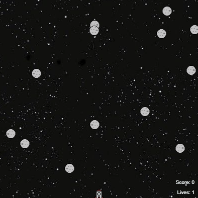

# SpaceRace
Instructions for python game where you are a rocket and must avoid asteroids

This project can be started by either:

1. Go to the starter project in trinket and remix it: https://trinket.io/python/2a47e8809a
2. Create a new project in trinket, copy and paste the contents of the start_code.py into the new project file, and add the images from resources directory to the trinket (top-left button of the text editing area).

Go through the details of each step in this repository to build up the components of the game.

[Go to step 1](../step01-create_rocket/)
