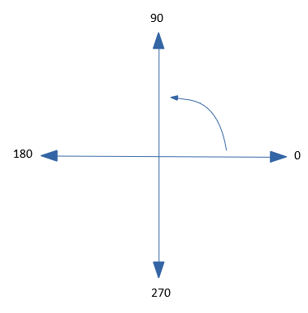

# Step 1 - Creating the rocket

***All the code in this step should go in the part of the code headed ```=== Rocket ===```***

The first thing we will do is create a rocket which the player will control.

To create the rocket we create a Turtle object and instruct it to use the `rocket.png` image:

```python
rocket = Turtle()
rocket.shape("rocket.png")
```

The turtle library can be used to draw shapes by leaving a line behind the turtle object as it moves; however, we don't want to draw anything so we tell the turtle to lift the (virtual) pen off the (virtual) paper:

```python
rocket.penup()
```

Now we want to put the rocket at the starting position, the starter code sets the screen size to 400 x 400 pixels. This means both the x-axis and y-axis start at -200 and finish at +200. We want the rocket to start at the bottom of the y-axis and the middle of the x-axis. Can you think what those coodinates should be? Click "Show code" to see how we move the rocket to the starting coordinates:

<details><summary>Show code</summary>
  
```python
rocket.goto(0,-190)
```
</details>

Run the code to check it. Looks as if the rocket is pointing in the wrong direction...

Each turtle object has a direction it is facing, specified by a number from 0 to 360: the default direction system in turtle looks like this:



0 degrees is to the right, 90 degrees is up, 180 degrees is to the left and 270 degrees is down. We want the rocket to be pointing *up*. The direction of the turtle can be set using the `setheading` function. Have a think what the code for that would look like and what number of degrees you would use for the heading. Check the following code to see if you were right:

<details><summary>Show code</summary>
  
```python
rocket.setheading(90)
```
</details>

Run the code again to check the rocket is now pointing up.

Now let's make it possible for the player to move the rocket. To do this we need to define *functions* to move the rocket. Here is how to define the function for moving the rocket up:

```python
def move_rocket_up():
  rocket.forward(5)
```

If we were to call this function like this:

```python
move_rocket_up()
```

then the rocket would move forward by 5 units. This uses the turtle ```forward``` function. There is also a function called ```back``` in the turtle library. Could you write a function for moving the rocket down? Check the code below:

<details><summary>Show code</summary>

```python
def move_rocket_down():
  rocket.back(5)
```
</details>

Now we make use of the turtle ```screen.onkey()``` function to connect these functions to the keyboard UP and DOWN arrow keys:

```python
screen.onkey(move_rocket_up, "up") # this specifies the code which will be run when the user presses the UP arrow
screen.onkey(move_rocket_down, "down") # this specifies the code which will be run when the user presses the DOWN arrow
```

That means when the up arrow key is pressed on the keyboard, it will call the function `move_rocket_up`, when the down arrow key is pressed, it will call `move_rocket_down`.

Now you should have a rocket image on the canvas which can be moved up and down with the arrow keys.

[Click here to go to step 2 to learn how to add the rocks.](../step02-create_rock/readme.md)

[Back to introduction](../README.md)
