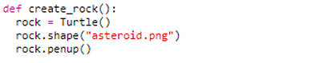
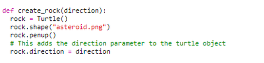
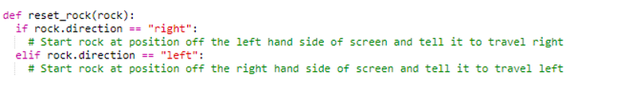
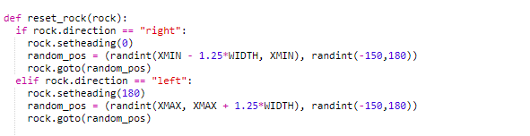
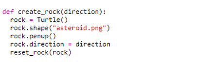
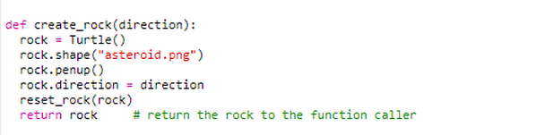
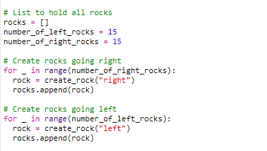
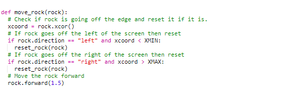

# Creating the rocks (asteroids)

## Creating a single rock

Next we need to create the asteroids which the player has to avoid.
There will be many asteroids so the code to create the asteroid will be needed many times.
One way to re-use the same bit of code multiple times is to put it in a function.
Two functions were defined in step01 for moving the rocket. As a reminder, the keyword `def`
is used to define a function.

***Note: the code below will be placed in the `========== Rocks ==============` part of the code.***

Can you write a function with the name `create_rock` which creates a Turtle object called ```rock```, tells it to use the `asteroid.png` image and to take the pen up. (The solution is below, but have a go at writing your code *before* you look at the solution.)

<details><summary>Show code</summary>

<br>



</details>

In the game, there will be some asteroids travelling from right-to-left and some asteroids
travelling from left-to-right. We can modify the `create_rock` function such that it takes an option
which instructs the rock to travel left or travel right. We can do this by adding a function parameter
called `direction` in the parentheses:



As with the rocket, we need to give each asteroid a heading. In step01, an orientation plot showed the values needed for various directions. Can you remember the values required for left and right? Let's
write a function that can put the asteroid in a starting position and set its heading:



That function takes a rock as a parameter and it checks if the direction of the rock is set to
`"right"` or `"left"`. At the moment I have put a comment in the code to describe the logic
that needs to be completed. The following code block shows the completed function:



This generates random starting positions for the asteroids. These positions are actually off the
visible viewing area, this means that when they start travelling they will move into the visible
area and eventually go off the other end of the visible area.

We need to call `reset_rock` on every rock that we create in `create_rock`. Do you know where you will need to put the call to `reset_rock`? It should be put at the bottom, the important bit is that `reset_rock` comes after setting the `direction`: 



Currently, if we call this function, it will create the rock, set the position and heading,
but do nothing else with it.
When the function gets to the end, the `rock` object will no longer be accessible and will eventually destroyed. In order to keep/store the rock after the function finishes, the rock is returned from the
function by using the `return` keyword:



So now if we wanted to create a rock we could write the following code:

```python
rock = create_rock("left")
```

to create a rock moving to the left, or

```python
rock = create_rock("right")
```

for a rock moving to the right.

However, that will give us just one rock, and we want lots of rocks!

## Creating multiple rocks

***Note: we're still adding code in the `========== Rocks ==============` part of the project.***

In order to create multiple rocks we are going to use a couple of `for` loops.
Some incomplete code is below, the missing parts are indicated with XXX.
See if you can fill in the missing parts:

```python
# List to hold all rocks
rocks = []
number_of_left_rocks = 15
number_of_right_rocks = 15

# Create rocks going right
for _ in range(XXX):
  rock = create_rock("right")
  rocks.append(XXX)

# Create rocks going left
for _ in range(number_of_left_rocks):
  XXX = create_rock("XXX")
  XXX.append(rock)
```

<details><summary>Click here to see the solution</summary>



</details>

After this code has executed, the `list` should contain 30 rock objects.
The rocket is controlled by the user pressing keys, the asteroids must be moved by the code itself.
That is the final step to the asteroids.

## Set the asteroids in motion

***Note: the next two lines of code go in the `============ Main loop ================` part of the project.***

It's time to modify the "Main loop" section of the starter code. The rocks need to be moved as
part of the main loop. In order to move all the rocks, the code must loop over each rock. Can you think of something in python for looping? It is the `for` loop again, the `for` loop can be used to loop
(iterate) over the rocks. Put the next two lines of code just after the line which says ```while playing:```, but **make sure you indent these lines correctly**. The first line will be indented once, but the second line needs to be indented twice.

```python
  for rock in rocks:
    move_rock(rock)
```

***Note: we will put the ```move_rock()``` function in the `========== Rocks ==============` part of the project.***

The code above assumes there is a function called `move_rock` which takes a rock as the parameter.
So let's write the `move_rock` function. Here is some incomplete code again, trying filling in the gaps:

```python
def move_rock(rock):
  # Check if rock is going off the edge and reset it if it is.
  xcoord = rock.xcor()
  # If rock goes off the left of the screen then reset
  if rock.direction == "left" and xcoord < XXX:
    reset_rock(rock)
  # If rock goes off the right of the screen then reset
  if rock.direction == "right" and XXX > XMAX:
    reset_rock(rock)
  # Move the rock forward
  rock.XXX(1.5)
```

<details><summary>Click here to see the solution</summary>
  


</details>

 This function takes care of moving the rocks left and right (using rock.forward),
 but it is also responsible for resetting the rocks when they go beyond the edges of the screen.

Test your code by clicking on Run. If you have completed this step properly, you should see asteroids moving to the left and to the right across the screen. You should also be able to move your rocket up and down with the arrow keys (but don't forget to click in the graphics window first to activate this pane).

[Click here to go to step 3 to add collisions between the rocks and the rocket.](../step03-add_collisions/readme.md)
