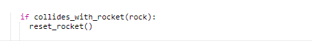
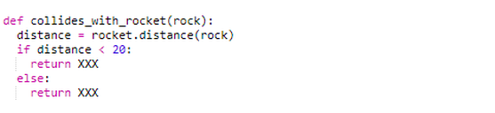
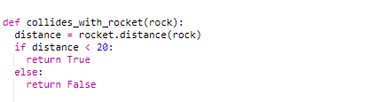
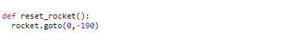

# Step 3 - Detecting when an asteroid hits the rocket

At the moment, you should have a rocket, which you can move up and down, and some asteroids flying across the screen.
However, the asteroids can go straight over the rocket. Let's add in some code to detect an asteroid colliding with the rocket.

First let's add something to the main loop. It's worth mentioning that pretty much all games out there will have a main loop (or event loop).
This is a loop which is always cycling, and can check if the user has pressed a button, clicked a mouse, or if something else has happened, such
as an asteroid hitting a rocket. 

At the end of the last step, we added some code to the main loop which moved the rocks across the screen.
Now we want to check if any asteroid has hit the rocket after it moved. Add the following bit of code to the end of the `for` loop inside the main loop which begins `for rock in rocks:`:

Make sure this is indented to the same level as the `move_rock` line - this will ensure it is in the rock loop. If we try to test this new code it will break the code
because we have referred to two functions which we haven't written yet. Do you know what the names of those functions are?

***Note: the two new functions we need to write will be placed in the `=== Rocket ===` part of the code.***

The first function we will add is one which checks if the rocket has collided with a rock. It does this using the turtle `distance` function which measures the distance between two turtles. If the distance gets too small then the code assumes a collision has happened. The code below is missing the return values (`XXX`). I can tell you that one of the `XXX` is `True`, and one of them is `False`, can you figure out which one is which? You will need to look at the code that was added to the main loop to help you:

Show solution

The solution shows that we return `True` if the distance is less than 20 units from the rocket to the asteroid, and `False` if the distance
is greater than or equal to 20. This means that the function `collides_with_rocket` will return `True` if the asteroid is close to (touching) the rocket,
it will return `False` if the asteroid is not touching to the rocket.

The next function that we need to add is `reset_rocket`. This will be a small function that moves the rocket back to the starting position when it has hit an asteroid. In step 1 of this game we wrote code to send the rocket to its starting position; can you find the line of code that moves the rocket to the starting position, and then use that code to create a function called `reset_rocket` that moves the rocket to the same starting position again? The solution is below:

Show solution

Ensure this function is defined after the `rocket` turtle has been created.

Now try moving the rocket up and let it get hit by an asteroid. The rocket should "reset" and move back to the beginning.

[Click here to go to step 4 to add a score to the game.](../step04-add_score/readme.md)

[Back to Step 2](../step02-create_rock/readme.md)
