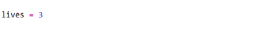
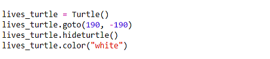
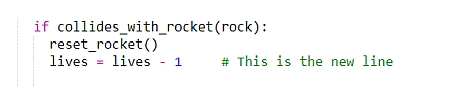
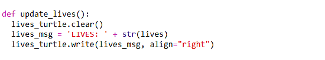

# Step 5 - Adding lives to the game

So far you have coded up a game with a rocket and asteroids, and there
is a score that increases each time the rocket gets to the top. However, this will go on forever! The game should
have an end. We will give the player 3 lives before it is "game over".

At the end of the ***"Scores & Lives"*** section of the code, create a `lives` variable and set it to 3.

<details><summary>Show solution</summary>



</details>

Now, copy and paste the code for setting up the `score_turtle` just below your new variable. In the pasted code, replace
the word `score_turtle` with `lives_turtle`. Then change the y-position of the `goto` such that the `lives_turtle` goes
20 units lower down on the screen than the `score_turtle`. Check your code against the solution below:


<details><summary>Show solution</summary>



</details>

After those changes, we have a `lives` variable to keep track of how many lives the player has, and we have a
`lives_turtle` to write the number to the screen. Now we need to modify the code in the ***main loop*** to decrease the
number of lives when the rocket collides with an asteroid. Take a look at the main loop and see if you can find 
where would be a good place to decrease the number of lives. Is there somewhere that already checks for a collision
with a rock? 

If you said "within the `if collides_with_rocket(rock)` block" then you are right! Add in a line of
code so it decreases the `lives` variable by 1 if the rocket collides with a rock:

<details><summary>Show solution</summary>



</details>

For the `score` variable, we have a `update_score` function to write the `score` to the screen. We need a very similar
function but for the `lives` variable. Try copying and pasting the `update_score` function and calling it `update_lives`.
What do you need to change in the function in order for it to use the `lives_turtle` and also to write text to the screen
that tells the users how many "Lives" they have left?

<details><summary>Show solution</summary>



</details>

Now call the `update_lives` function immediately after you have decreased the number of lives by 1 when the rocket touches a rock, ***and again*** immediately after it is defined in order to write the number of lives to the screen before the start of the main loop:

```python
update_lives()
```

The score shown on the screen should now decrease each time the rocket is hit. However, does the game end at 0 lives? 

No, it does not, so we need to add more code to finish the game!

### Check your code

If you have followed all the instructions up to the end of step 5 your code for the ```=== Scores & Lives ===``` and ```=== Main loop ===``` sections should look something like [this](ex_step05.md).

### Next step

[Click here to go to step 6 to add a game ending](../step06-ending_the_game/readme.md)

[Back to Step 4](../step04-add_score)
