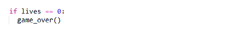
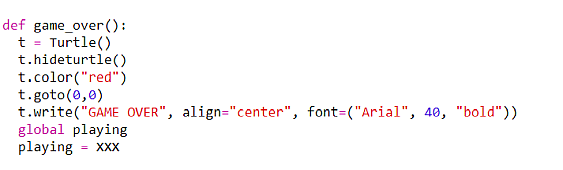
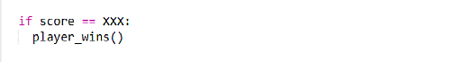
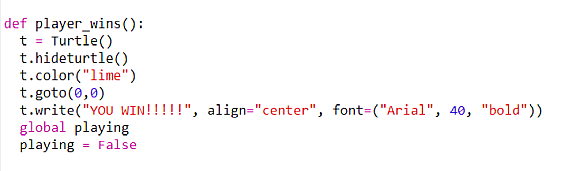
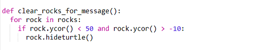
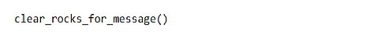

# Step 6 - Ending the game

## Losing the game

We have a `lives` variable, let us end the game when that gets to zero. Add the following to the main loop
just before the `screen.update()` and fill in the variable name of `XXX`:

```python
  if XXX == 0:
    game_over()
```

<details><summary>Show solution</summary>



</details>

Check the indentation here: we *don't* want to carry out this test once for every single rock, so the word `if` should *not* be indented to line up with the line `move_rock(rock)`. Instead, it should be indented to line up with the next line: `screen.update()`.

When the number of lives is zero, we call a function called `game_over`.
However, we now need to define the `game_over` function as we haven't yet written it. Put this new function in the ***`=== Win or lose ===`*** section of the code. 

I will give you most of the code for this function but there is one important value that I will miss out:



This creates a turtle, with red text which writes "GAME OVER" in the centre of the screen. This function also
modifies a global variable called `playing`. This variable should be either `True` or `False`, what do you think
`playing` should be if the game is ending. Hopefully you said `False`! If so, then you were right, `playing` should be `False`
if it is game over. This will exit the main loop and finish the code. If you try playing and collide with an asteroid 3 times then
you should see the GAME OVER message and the game should stop.

## Winning the game

The previous instructions say how to end the game by losing all the lives. Now let's add some code to be able to win the game 
when the player gets to a score of 3. Put this code in the main loop just after the check for `lives == 0`, what number will you put 
in for `XXX`:



This `if` block should be indented to line up with the previous `if` block, which tested for the value of `lives`.

Now define the `player_wins` function, this is very similar to the `game_over` function. Put this new function in the ***`=== Win or lose ===`*** section of the code. 
Copy and paste the `game_over` function and rename the function `player_wins`.  Now change the text colour from "red" to "lime", and change the message from "GAME OVER" to "YOU WIN".
Solution below:

<details><summary>Show solution</summary>



</details>

Now the game should end when the player gets to a score of 3!

## Tidy up end-game message

Currently, the "GAME OVER" or "YOU WIN" message could be overlapping with asteroids. It would be nice to delete the asteroids that are overlapping
when the message shows. Add the following function in the ***`=== Win or lose ===`*** section of the code:



This hides the rocks if they are in the area of the end-game message.

Finally, call this function after either of the end-game messages is written i.e. put the following line before `playing = False` in each of
`game_over` and `player_wins` functions:



And that's the end of this project! You should now have a functioning space race game coded in python.

## Further Challenges

Here are some further challenges if you want to keep developing the game:

1. Give the rocks different random speeds. Look how we stored the direction in the rock object, and see if you can add a speed attribute. Then you
   will need to use the speed attribute in the correct part of the code. 
2. Add the capability to restart the game without needing to re-run the trinket code. One way to do this would be to add another loop to the main
   loop. You will want the lives/score to reset, and the rocket to go to the start. Once this has been done, a high score feature could be added to
   the game.
3. Add an explosion when a rock hits the rocket. This would need a new image uploaded and some extra code in the collision detection.
4. Add a blaster weapon to the rocket that can destroy the rocks in its path! This will make the game a bit easy but it would be fun to add. Can you
   add code so a blaster fires when the space-bar is pressed? You could do this by creating a turtle object to represent the shot, and then writing
   collision code for if it hits a rock!

[Back to Step 5](../step05-add_lives/readme.md)
